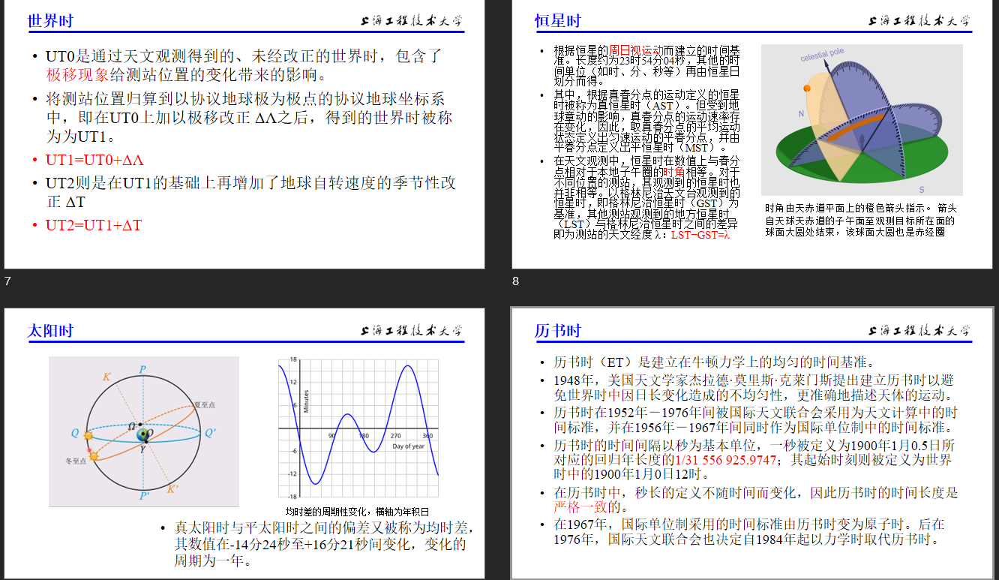
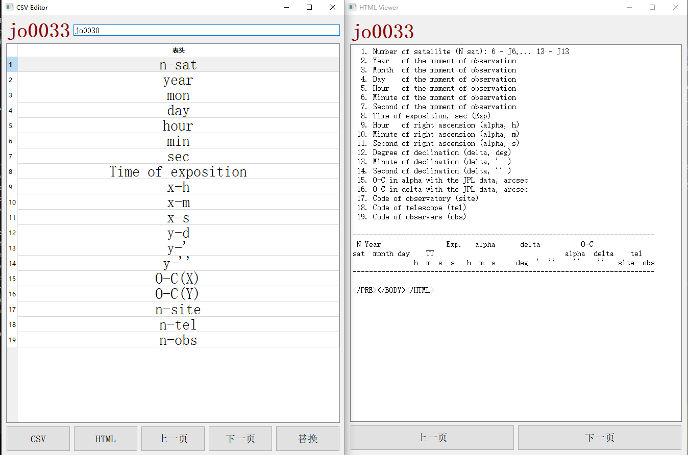

## 1. Organization

- **2024.11: 完成NSDC的数据处理✅**
- **2024.12: 搜集新数据整理&准备考试📚**
- **2025.01: 完成所有的数据&转换🔄**
- **2025.02: 完善数据分析&矫正并撰写初稿✍**
- **2025.03: 正式撰写文章📄**
- **2025.04: 完善文章准备投递📬**

## 2. Record

### Date Preprocessing

#### 1. html info

首先，因为NSDC上的数据是以content+data的双文件形式存储的。编写一个类似于爬虫的文本分析文件，将每一个content 的相关数据都整理到了一个csv文件，称之为information。Information里包含了时间系统、坐标系统和观测台等信息，方便在某些数据记录中不包含某些数据时补上。
Information中包含了以下字段的信息
Id、Type、Dates、Observatory、Reference Frame、Centre of Frame
Epoch of Equinox、Time Scale、Reduction、Coordinates、Diffraction
Receptor、Telescope、Observers、Relative To


其次，因为最一开始并不了解时间系统和坐标系统的概念和定义，故统计出了information中出现的所有时间系统的类型。





#### 2. csv errror

Python对txt文件并不算特别友好，计划将txt文件转换成了csv文件方便之后的各种操作，但是转换途中发现有的观测数据的格式并不完整，编写了一个csv_error程序分析格式错误并改正。


改正所有错误之后开始对txt文件进行转换。并给所有的csv文件添加了一个表头，便于根据表头实现对多表的合并。

#### 3. csv convert

转换之后的csv文件如下，我为每个数据加上前后括号强制转换为文本，防止数据精度丢失。


#### 4. csv header

为了批量处理时间到统一的格式，亦或方便去对不同的数据类型处理，例如有些数据是赤经赤纬，有些数据是空间坐标。因此要将Data中的数据对应上相应的列名，编写了一个程序首先给所有csv文件增加一行标题行，然后通过编写一个软件实现直接更改各个文件的表头的功能，另外为了防止出错，在右侧会同步输出html文件，最后加上二次验证。确保所有的数据是准确无误的。
替换表头程序：



#### 5. csv utils


### Date Conversion

#### 1. csv merge

基于上述的数据准备，编写一个简单的程序就能实现多表合并，还为所有的行都新增了一列id，以文件名+行号形式构成，方便对数据的检索和对某些指定的数据整理。整合之后的表格如下。一共包含了内部、外部、伽利略卫星等十几个卫星的5万多条观测数据，基本实现了对观测数据的整合。


#### 2. csv extractor

通过前期整理，总计整理了57258条卫星星表数据。原始文件类型

| file_line    | year       | mon      | day             | hour | min  | sec  | JD   |
| ------------ | ---------- | -------- | --------------- | ---- | ---- | ---- | ---- |
| **jg0002_2** | **[1998]** | **[08]** | **[26.999456]** |      |      |      |      |

使用excel函数可以实现对数据的分类。

```
=IF(AND(ISNUMBER(SEARCH(".", D2)), D2<>"", E2="", F2="", G2="", H2="", I2="", J2="", A2<>""), 1,
   IF(AND(A2<>"", B2<>"", C2<>"", D2<>"", E2<>"", F2<>"", G2<>"", H2="", I2="", J2=""), 2,
   IF(AND(H2<>"", I2="", J2=""), 3,
   4)))
```

整理如下

| 时间系统                                                     | 数据类型                                                     | 数据数量                                                   |
| ------------------------------------------------------------ | ------------------------------------------------------------ | ---------------------------------------------------------- |
| **UTC<br/>TT<br/>GMT<br/>Cape sideral time<br/>UT1<br/>UTC-3h<br/>ET<br/>TCB<br/>TDB** | **第1类：** 只有 `file_line`、`year`、`mon`、`day` 有值，且 `day` 列的值含小数点，其余列为空。<br/>**第2类：** 只有 `file_line`、`year`、`mon`、`day`、`hour`、`min`、`sec` 有值，其余列为空。<br/>**第3类：** 只有 `jd` 列有值，其余列为空。<br/>**第4类：** 不符合上述任何规则。 | **1	22964<br/>2	10726<br/>3	14396<br/>4	9172** |


异常数据

| 文件名     | 类别  | 出现总次数 | 异常                      | 处理                                                         |
| ---------- | ----- | ---------- | ------------------------- | ------------------------------------------------------------ |
| **jg0001** | **2** | **1606**   | **sec格式不一**           |                                                              |
| **jg0004** | **3** | **144**    | **有jd,无时分秒**         | **按jd**                                                     |
| **jg0008** | **4** | **738**    | **Cape sideral time**     |                                                              |
| **jg0032** | **3** | **448**    | **有jd,有年月带小数的秒** | **按jd**                                                     |
| **ji0015** | **3** | **54**     | **jd**                    | **Julian date of observation (TDB)**                         |
| **jg0020** | **4** | **26**     | **mjd**                   | **MJD - time of topocentric observation (MJD=JD-2400000.5), TT** |
| **jg0021** | **4** | **16**     | **mjd**                   | **MJD - time of topocentric observation (MJD=JD-2400000.5), TT** |
| **jg0069** | **4** | **209**    | **Epoch_TCB**             | **Gaia-centric epoch in TCB relative to 2455197.5 (Epoch_TCB, days)** |
| **jg0073** | **4** | **295**    | **Epoch_TCB**             | **Gaia-centric epoch in TCB relative to 2455197.5 (Epoch_TCB, days)** |
| **ji0001** | **4** | **35**     | **hour带小数无min sec**   | **Hour of the moment of observation with decimals**          |
| **ji0002** | **4** | **160**    | **hour带小数无min sec**   | **Hour of the moment of observation with decimals**          |
| **ji0004** | **4** | **123**    | **hour带小数无min sec**   | **Hour of the moment of observation with decimals**          |
| **ji0005** | **4** | **156**    | **min**                   | **Minutes from 0 h UTC, 3 December 1988 (JD=2447498.5)**     |
| **ji0007** | **4** | **10**     | **mjd**                   | **MJD of observation with decimals (43494 = 17 Dec 1977)**   |
| **jo0069** | **4** | **1712**   | **Epoch_TCB**             | **Gaia-centric epoch in TCB relative to 2455197.5 (Epoch_TCB, days)** |
| **jo0077** | **4** | **3756**   | **Epoch_TCB**             | **Gaia-centric epoch in TCB relative to 2455197.5 (Epoch_TCB, days)** |
| **jo1057** | **4** | **92**     | **Epoch_TCB**             | **Gaia-centric epoch in TCB relative to 2455197.5 (Epoch_TCB, days)** |
| **jo1061** | **4** | **238**    | **Epoch_TCB**             | **Gaia-centric epoch in TCB relative to 2455197.5 (Epoch_TCB, days)** |

#### 3. Astropy

1. 数据分类：数据根据 `classify` 列分为四大类：
   - 第1类 (`classify=1`)：
     - 仅 `file_line`、`year`、`mon` 和 `day` 列有值。
     - `day` 列包含小数，表示完整时间（包括日、时、分、秒）。其他列均为空。
   - 第2类 (`classify=2`)：
     - 仅 `file_line`、`year`、`mon`、`day`、`hour`、`min` 和 `sec` 列有值。其他列均为空。
   - 第3类 (`classify=3`)：
     - 仅 `jd` 列有值。其他列均为空。
   - 第4类 (`classify=4`)：
     - 不符合上述任何分类规则，直接输出 `null`。
2. 时间尺度：数据的时间尺度已在 `scale` 列中标明，可包含以下值：
   - `UTC`、`TT`、`GMT`、`UT1`、`UTC-3h`、`ET`、`TCB`、`TDB`。
3. 目标转换：
   使用 PyMsOfa 库或其他时间转换工具，只对前三类处理，将不同时间尺度、不同格式的数据统一转换为 UTC 时间下的儒略日（`JD`）。第四类直接输出null。
4. 字段含义：
   - `file_line`: 数据索引或标识符。
   - `scale`: 时间尺度（如 UTC、TT 等）。
   - `year`: 年。
   - `mon`: 月。
   - `day`: 日。
   - `hour`: 小时。
   - `min`: 分钟。
   - `sec`: 秒。
   - `jd`: 儒略日。
   - `mjd`: 修正儒略日。
   - `Epoch_TCB`: TCB 时间纪元。
   - `classify`: 分类标识符（1 表示第 1 类，2 表示第 2 类，3 表示第 3 类，4 表示第 4 类）。

------

初步完成了46380条数据的转换

```python
import pandas as pd
from astropy.time import Time
import numpy as np
import re  # 用于清理数据
from PyQt5.QtWidgets import QApplication, QMessageBox, QTableWidget, QTableWidgetItem, QVBoxLayout, QWidget
import sys

# 读取 CSV 文件
file_path = "./Result/time_scale.csv"  # 替换为你的文件路径
df = pd.read_csv(file_path)

# 定义清理函数
def clean_brackets(value):
    """去除字符串中的方括号，并转换为数值"""
    if pd.isna(value):  # 如果是 NaN，则直接返回
        return np.nan
    if isinstance(value, str):  # 如果是字符串，尝试去掉方括号
        value = re.sub(r'[\[\]]', '', value)
    try:
        if '.' in value:  # 如果包含小数点，转换为浮点数
            return float(value)
        return int(value)  # 否则转换为整数
    except ValueError:
        return np.nan  # 无法解析时返回 NaN

# 清理需要处理的列
columns_to_clean = ['year', 'mon', 'day', 'hour', 'min', 'sec', 'jd']
for col in columns_to_clean:
    df[col] = df[col].apply(clean_brackets)

# 定义转换函数
def convert_row_to_jd(row, errors):
    try:
        classify = int(row['classify'])  # 确保 classify 是整数
        scale = str(row['scale']).lower()  # 确保 scale 小写

        allowed_scales = ['local', 'tai', 'tcb', 'tcg', 'tdb', 'tt', 'ut1', 'utc']
        if scale not in allowed_scales:
            raise ValueError(f"Scale '{scale}' is not in the allowed scales {allowed_scales}")

        if classify == 1:
            # 第1类：year, mon, day (day 包含小数)
            year, mon, day = int(row['year']), int(row['mon']), float(row['day'])
            time = Time(f"{year}-{mon}-{day:.6f}", scale=scale, format='iso')
            return time.utc.jd

        elif classify == 2:
            # 第2类：year, mon, day, hour, min, sec
            year, mon, day = int(row['year']), int(row['mon']), int(row['day'])
            hour, minute, second = int(row['hour']), int(row['min']), float(row['sec'])
            time = Time(f"{year}-{mon}-{day} {hour}:{minute}:{second:.6f}", scale=scale, format='iso')
            return time.utc.jd

        elif classify == 3:
            # 第3类：JD
            jd = float(row['jd'])
            time = Time(jd, scale=scale, format='jd')
            return time.utc.jd

        else:
            # 第4类：直接输出 null
            return np.nan
    except Exception as e:
        # 收集异常信息
        errors.append({'row': row.to_dict(), 'error': str(e)})
        return np.nan

# 初始化 PyQt 应用
app = QApplication(sys.argv)

# 收集错误信息
errors = []

# 应用转换函数
df['utc_jd'] = df.apply(lambda row: convert_row_to_jd(row, errors), axis=1)

# 如果有错误，显示错误信息
if errors:
    # 创建窗口
    window = QWidget()
    window.setWindowTitle("Error Report")
    layout = QVBoxLayout()

    # 创建表格
    table = QTableWidget()
    table.setRowCount(len(errors))
    table.setColumnCount(2)
    table.setHorizontalHeaderLabels(["Row Data", "Error Message"])

    # 填充表格
    for i, error in enumerate(errors):
        table.setItem(i, 0, QTableWidgetItem(str(error['row'])))
        table.setItem(i, 1, QTableWidgetItem(error['error']))

    layout.addWidget(table)
    window.setLayout(layout)
    window.show()

# 保存结果到新的 CSV 文件
output_file = "./Result/output_time_scale.csv"
df.to_csv(output_file, index=False)

print(f"转换完成，结果已保存到 {output_file}")

# 运行 PyQt 应用
sys.exit(app.exec_())
```

